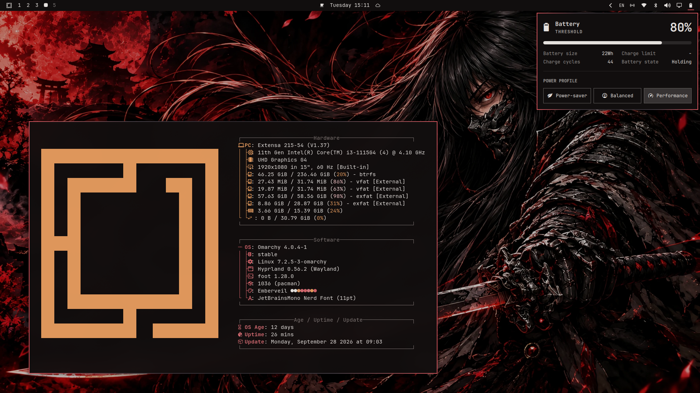

# Emberveil



A dark Omarchy theme built around a single ember accent on a warm near-black
base. The active window border carries a gradient that fades to the background
at the centre of the edge, so windows read as lit at the corners and dim in the
middle rather than sitting inside a flat outline.

## Palette

| Role | Colour |
|---|---|
| Background | `#110e0e` |
| Foreground | `#e4e0dd` |
| Accent (ember) | `#d4545c` |
| Selection bg | `#d4545c` |
| Selection fg | `#110e0e` |
| Muted | `#7d7472` |
| Dark surface | `#3a2427` |

The 16-colour ANSI ramp is defined in `colors.toml` and is what terminals,
Zed, btop and the shell all read, so editing `colors.toml` updates the whole
desktop. Every `bright_*` slot is genuinely lighter than its `regular_*`
counterpart so that bold text and TUI key hints stay legible. Neovim is the one
exception: it uses Ashen, see [Neovim](#neovim) below.

## Border gradient

The gradient lives in one field and drives both Hyprland windows and the
shell's popups:

```toml
hyprland_active_border = "#d4545c #443c44 #2e2a30 #443c44 #d4545c"
```

Dropping the trailing `deg` angle gives the horizontal default. `90deg` is
vertical, `45deg` diagonal. Note that Hyprland maps a linear gradient across the
whole window box, so `45deg` and `0deg` skew on non-square windows; the
horizontal default is the one that stays balanced across aspect ratios.

The middle stops are a cool grey rather than a darker red on purpose: the
wallpaper is a very red image, and red-on-red left the midtones of the border at
a contrast of ~1.1 against it (effectively invisible). The grey lifts them to
~1.4-1.7 so the whole ramp reads while still fading in the middle.

## Background

`backgrounds/BG2.webp` is a red-and-black character illustration whose visible
colour sits almost entirely at hue 356°, the same hue as the ember accent. It
is veiled (brightness ×0.72, saturation ×0.88) so the image's red does not
compete with the UI accent, and stored as WebP q88 to keep the repository
light (0.77 MB, down from 9.26 MB).

## Files

| File | Applies to |
|---|---|
| `colors.toml` | source of truth, drives every template below |
| `btop.theme` | btop (regenerated from `colors.toml`) |
| `hyprland.conf` | window/decoration settings and colours |
| `hyprlock.conf` | lock screen colours |
| `neovim.lua` | Neovim, sets `colorscheme = "ashen"` |
| `alacritty.toml`, `ghostty.conf`, `kitty.conf`, `warp.yaml` | terminals |
| `gtk.css` | GTK4 / Adwaita apps |
| `vencord.theme.css` | Discord (Vencord) |
| `emberveil.zed.json` | Zed |
| `walker.css`, `wofi.css`, `swayosd.css`, `waybar.css`, `mako.ini` | shell surfaces |
| `backgrounds/BG2.webp` | desktop background |

### Files that `omarchy theme install` does not copy

Omarchy deliberately drops a few files when installing a theme from a git
repository, because they can name a program to launch. **These files are in the
repository for you to copy by hand, but installing the theme will not put them
on your machine:**

| File | Why it is skipped |
|---|---|
| `neovim.lua` | `*.lua` is dropped (Neovim loads it at startup) |
| `alacritty.toml`, `ghostty.conf`, `kitty.conf` | terminal configs name the program to launch |

Everything else — `colors.toml`, `backgrounds/`, `preview.png`,
`hyprland.conf`, `hyprlock.conf`, the CSS files, `btop.theme`,
`chromium.theme`, `icons.theme` and the Zed theme — is installed normally and
needs no manual step.

If you want the skipped ones, the instructions are below.

## Neovim

Emberveil does not ship its own editor colorscheme. Neovim uses
[ashen.nvim](https://github.com/ficcdaf/ashen.nvim), a warm ember-toned dark
theme, which pairs with the ember accent without a second palette to keep in
sync.

`neovim.lua` is **not** installed automatically (see the note above). To get
Ashen, add the plugin and set the colorscheme in your own LazyVim config.

For LazyVim, create `~/.config/nvim/lua/plugins/neovim.lua`:

```lua
return {
  { "ficcdaf/ashen.nvim" },
  {
    "LazyVim/LazyVim",
    opts = {
      colorscheme = "ashen",
    },
  },
}
```

Restart Neovim afterwards. If Ashen does not appear, run `:Lazy sync` once.

If you would rather have a colorscheme generated straight from `colors.toml`,
skip Ashen entirely and delete `neovim.lua` from your copy of the theme —
Omarchy then regenerates it from the palette on every `omarchy theme set`.

## Terminals

The terminal configs are **not** installed automatically. Each one is a drop-in
file you copy to the right place. Pick the one for the terminal you use; you do
not need more than one.

```bash
THEME=~/.config/omarchy/themes/emberveil

# Alacritty
mkdir -p ~/.config/alacritty && cp "$THEME/alacritty.toml" ~/.config/alacritty/

# Ghostty
mkdir -p ~/.config/ghostty && cp "$THEME/ghostty.conf"    ~/.config/ghostty/config

# Kitty
mkdir -p ~/.config/kitty && cp "$THEME/kitty.conf"        ~/.config/kitty/

# Warp
mkdir -p ~/.config/warp-terminal/themes && cp "$THEME/warp.yaml" ~/.config/warp-terminal/themes/
```

If you use **foot** (the Omarchy default) you do not need to do anything: foot
is generated from `colors.toml` automatically.

## Look'n'feel

Omarchy does not source `hyprland.conf` automatically. Hyprland reads the
generated `hyprland.lua`, which already carries the border gradient, so the
theme alone gives you the palette and the border. The rest of the look'n'feel —
gaps, blur, shadows, dimming, tearing — is in `hyprland.conf` and has to be
applied by you.

The settings it carries are:

| Setting | Value |
|---|---|
| Gaps | `gaps_in = 4`, `gaps_out = 8` |
| Border size | `border_size = 2` |
| Blur | `size = 10`, `passes = 2`, `new_optimizations = true` |
| Shadow | `range = 16`, `color = rgba(00000052)` |
| Motion blur | enabled |
| Dim inactive | `dim_inactive = true`, `dim_strength = 0.5` |
| Tearing | `allow_tearing = true` |
| Layout | `dwindle` |
| Rounding | not forced (Omarchy's default) |

You have two ways to apply them.

**Option A — source the file.** Add this to the bottom of
`~/.config/hypr/hyprland.lua`, after the Omarchy requires:

```lua
source = (os.getenv("HOME") .. "/.config/omarchy/themes/emberveil/hyprland.conf")
```

**Option B — copy the settings.** Add them to
`~/.config/hypr/looknfeel.lua`, which Omarchy already loads for you. This is
the tidier option because it keeps your own config self-contained:

```lua
hl.config({
  general = {
    allow_tearing = true,
    gaps_in = 4,
    gaps_out = 8,
    border_size = 2,
  },
  decoration = {
    motion_blur = { enabled = true },
    blur = {
      enabled = true,
      size = 10,
      passes = 2,
      new_optimizations = true,
    },
    shadow = {
      enabled = true,
      range = 16,
      color = "rgba(00000052)",
    },
    dim_inactive = true,
    dim_strength = 0.5,
  },
})
```

Then reload Hyprland:

```bash
hyprctl reload
```

**Lock screen.** `hyprlock.conf` only defines colours. Source it from your own
hyprlock config to get a matching lock screen:

```conf
source = ~/.config/omarchy/themes/emberveil/hyprlock.conf
```

## Install

```bash
omarchy theme install emberveil
```

Or from the URL directly:

```bash
omarchy theme install https://github.com/amaurisd97/omarchy-emberveil-theme.git
```

Then apply it:

```bash
omarchy theme set "Emberveil"
```

Cycle through the bundled background with `omarchy theme bg next`.

## Credits

- Palette direction and the original file layout come from
  [Vengeance](https://github.com/Grey-007/vengeance) by Grey-007.
- Neovim support uses [ashen.nvim](https://github.com/ficcdaf/ashen.nvim) as a
  separate dependency, not bundled here.
- The wallpaper was generated with AI image tools (ChatGPT and Gemini) and is
  released under the same MIT license as the theme.

## License

MIT. See [LICENSE](LICENSE).
